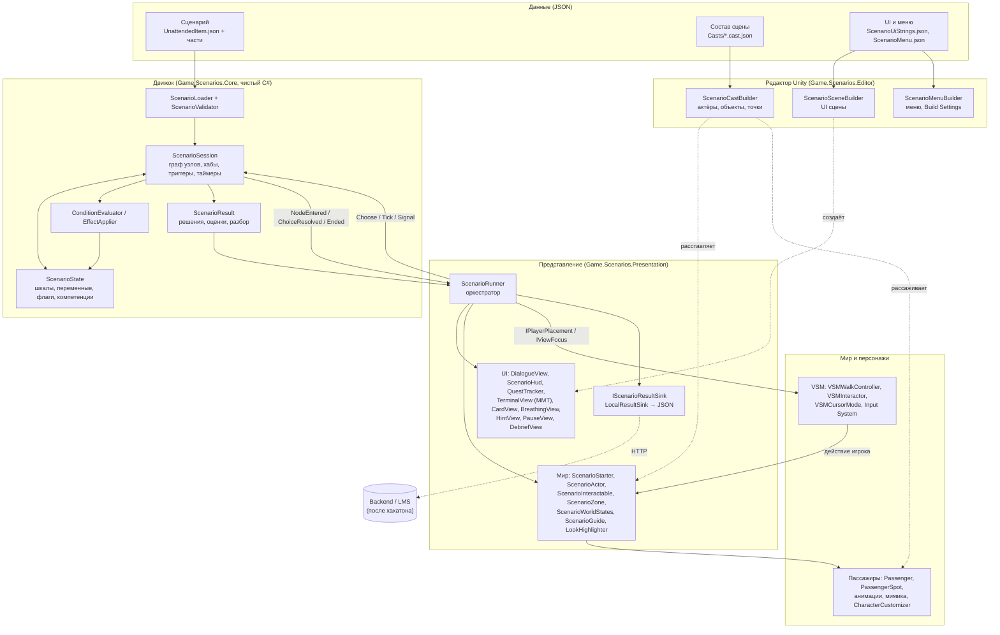
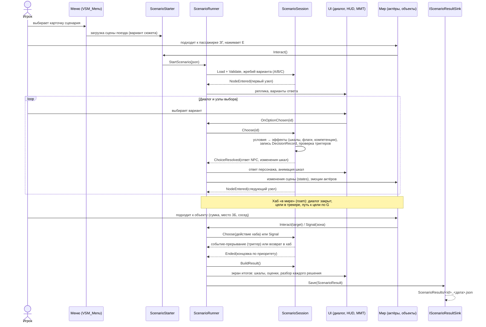
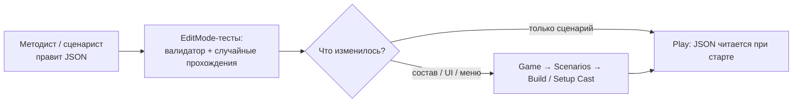

# Архитектура решения

Тренажёр проводника ВСМ на Unity 6 (URP), сборки под Windows и WebGL. Главный принцип: **сценарий целиком описывается данными**. Тексты, ветвление, эффекты на шкалы, разбор и расстановка персонажей лежат в JSON, код не знает конкретного сюжета.

Подробности формата сценария и движка - в [Docs/ScenarioEngine_RU.md](../../Docs/ScenarioEngine_RU.md).

## Слои

Решение разделено на четыре слоя с однонаправленными зависимостями:

| Слой | Сборка | Ответственность |
|---|---|---|
| **Данные** | `Assets/Data/Scenarios` | Сценарий (`*.json`), состав сцены (`Casts/*.cast.json`), строки UI и меню (`Ui/*.json`) |
| **Движок** | `Game.Scenarios.Core` | Чистый C# без зависимостей от Unity: граф узлов, условия, эффекты, шкалы, таймеры, триггеры, концовки, запись решений |
| **Представление** | `Game.Scenarios.Presentation` | Связка движка со сценой: диалоги, HUD, терминал ММТ, разбор, актёры, объекты и зоны в мире, сохранение результата |
| **Мир и персонажи** | VSM + `Game.Characters.*` | Модель поезда, ходьба от первого лица, взаимодействие, пассажиры (рассадка, анимации, мимика, внешность) |

Отдельно - **редакторские билдеры** (`Game.Scenarios.Editor`): собирают UI, меню и расстановку актёров в сцене из JSON. Сцена руками не правится и всегда воспроизводима.

## Диаграмма компонентов

Зависимости: `Presentation → Core`, `VSM → Presentation`, `Presentation → Characters`. Core не знает ни о сцене, ни об UI, поэтому вся игровая логика покрыта EditMode-тестами (93 теста, включая по 30 случайных прохождений каждого варианта сюжета до концовки).

## Диаграмма последовательности: прохождение сценария

## Поток создания контента

## Ключевые решения

- **Данные отделены от кода.** Новая развилка или вариант сюжета - правка JSON за несколько минут, без программиста и пересборки кода. Крупный сценарий делится на части через `include`.
- **Детерминированный движок.** Время двигается только через `Tick`, случайность только в жребии варианта, поэтому любое прохождение воспроизводимо в тестах.
- **Единое состояние-словарь** (`loyalty`, `safety`, `var.*`, `flag.*`, `comp.*`, `variant.*`, `visited.*`): одни и те же условия и эффекты работают для шкал, скрытых переменных и компетенций.
- **Мир общается с движком через интерфейсы** (`IScenarioInteractable`, `IPlayerPlacement`, `IViewFocus`, сигналы зон), поэтому модель поезда VSM можно заменить, не трогая движок.
- **Точка расширения для backend.** Результат прохождения уже сериализуется в JSON (сценарий, вариант, концовка, шкалы с оценками, компетенции, все решения с разбором, подсказки, длительность). Это контракт для будущего сервера: достаточно реализовать `IScenarioResultSink` с HTTP-отправкой.

## Стек

Unity 6 (URP), Input System, Cinemachine, VContainer, MessagePipe, UniTask, R3, DOTween, TextMesh Pro, Newtonsoft.Json. Персонажи - CharacterCustomizer и анимации Mixamo. Сборки: Windows и WebGL (хостинг в Yandex Object Storage).
